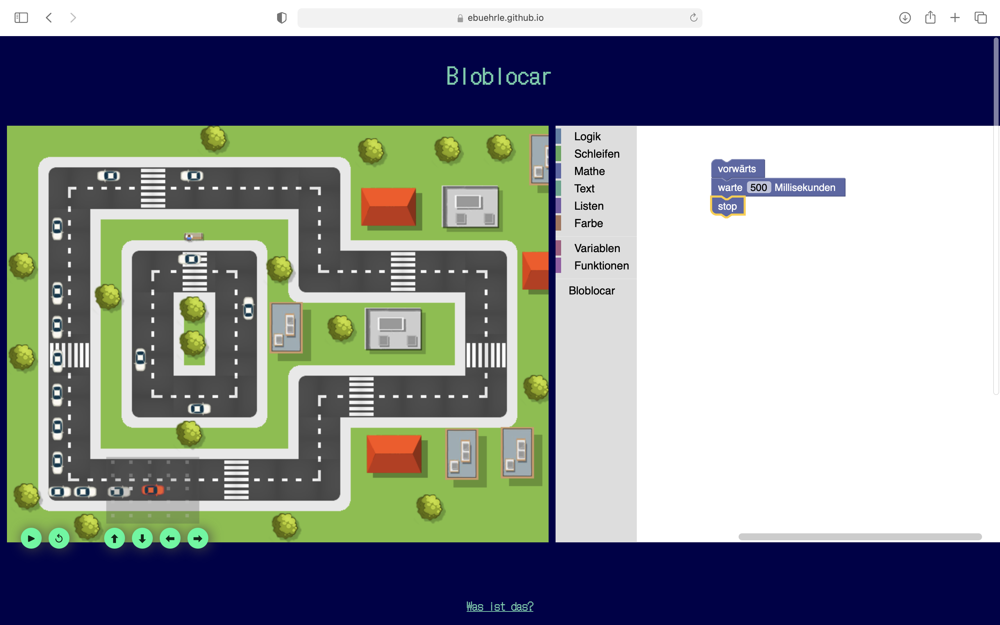

# Bloblocar
Bloblocar is a little browser-based programming course made for Girls' Day 2021, which was installed to attract girls to STEM fields. The goal of the course is to program the red car to get around the track without accidents, using its sensors. The programs can get pretty sophisticated.

The site is based on [metacar](https://github.com/thibo73800/metacar) and [Blockly](https://developers.google.com/blockly). You can try it out [here](https://ebuehrle.github.io/bloblocar).

## Is that ... German?
Yes. Unfortunately, I did not have the time to translate the Blockly blocks, yet, but most modern browsers are able to provide a pretty good translation of the tutorials.
